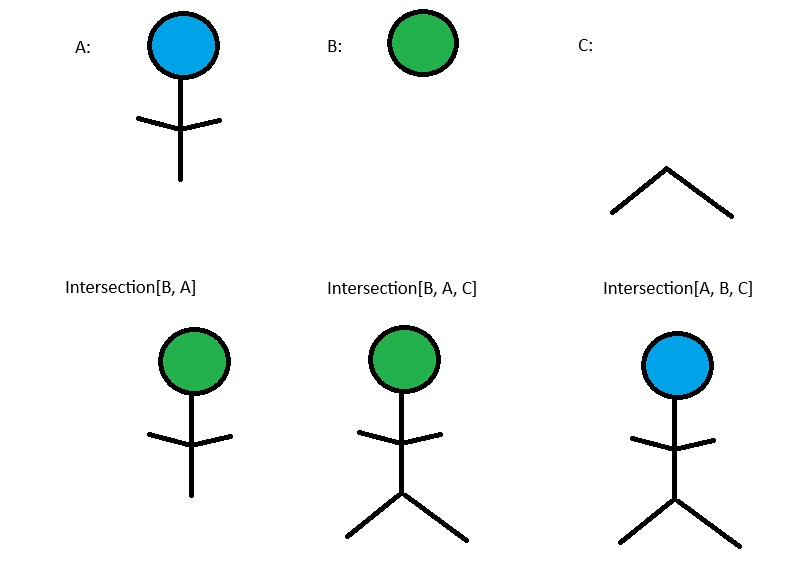

PEP: <REQUIRED: pep number>
Title: Intersection Type
Author: Mark Todd, mark@dreamingspires.dev
Sponsor: <real name of sponsor>
PEP-Delegate: <PEP delegate's real name>
Discussions-To: <REQUIRED: URL of current canonical discussion thread>
Status: Draft
Type: Standards Track
Topic: Typing
Requires: <pep numbers>
Created: <date created on, in dd-mmm-yyyy format>
Python-Version: <version number>
Post-History: <REQUIRED: dates, in dd-mmm-yyyy format, and corresponding links to PEP discussion threads>
Resolution: <url>

Abstract
========

This PEP proposes the addition of intersection types.
They are denoted as ``Intersection[A, B]`` and must:

- express all attributes and methods of the first type (here A);
- express all attributes and methods of each other type, unless superceded by a preceding type; and
- inherit from all specified types, in this mro ordering, unless the type is structural;

Intersection types are a complementary concept to union types introduced
in PEP-484.

The primary use cases for intersection types include:

- mixin classes, which require certain APIs to be available;
- wrapper types, which add to the original type without monkey patching;
- combining multiple protocols into a single structural type; and
- ad-hoc merging of TypedDict types;

This PEP outlines the syntax, assignability, consistency rules, and
other aspects related to intersection types.

Introduction
============

PEP-484 introduced the concept of a union type, written ``Union[A, B]``.
as a type expression, it describes values of either type ``A`` or type ``B``.

For example,

.. code-block:: py

    class A: ...
    class B: ...
    class C(A, B): ...
    class D(A): ...

    # PEP-604 was introduced to allow writing `Union[X, Y]` as `X | Y`
    def fu(value: A | B): ...

    fu(A())  # Valid
    fu(B())  # Valid
    fu(C())  # Valid
    fu(D())  # Valid

Intersection types provide a different (complementary) way of combining types.
The type expression ``Intersection[A, B]`` describes values that are consistent with both
type ``A`` and type ``B``.

For example,

::

    def fi(value: Intersection[A, B]): ...

    fi(A())  # Invalid
    fi(B())  # Invalid
    fi(C())  # Valid
    fi(D())  # Invalid

here it is valid to call ``fi`` on an instance of ``C``, but invalid to call it
with instances of ``A``, ``B`` or ``D``.

Motivation
==========

This allows

- the typing of class decorators which make predictable additions in capability
  to types. (ie. ``functools.total_ordering``)
- improved duck-typing (Mixing of protocols without redeclarations)
- improved use of TypedDict

Class Decorators
----------------

Class decorators often add behaviour to existing classes, but currently you can
only express the type of the produced class in specific cases. In the example
below the decorator takes a class and gives it an additional method ``foo``:

::

    class FooAble:
        def foo(self) -> int:
            return 1

    T = TypeVar("T", bound=object)
    def test(cls: T) -> Intersection[FooAble, T]:
        class NewCls(FooAble, cls):
            pass
        return cls

Protocols
---------

Protocols can now be combined in any way, to produce a new type

::

    from typing import Protocol

    class CanFoo(Protocol):
        def foo(self) -> int:
            ...

        def bar(self) -> int:
            ...

    class CanBar(Protocol):
        def bar(self) -> str
            ...

    def f1(x: CanFoo) -> int:
        return x.foo()

    def f2(x: Intersection[CanBar, CanFoo]) -> str
        return x.bar() + str(x.foo())

In this example, f2 can now take any class that can foo and can bar.
Previously this would have required defining a third class. Note how
here the bar method in CanBar takes priority.

TypedDict
---------

The TypedDict class can now be used to express the type of ``__getitem__``
more accurately:

::

    from typing import TypedDict, cast

    class DefinedGetAttr(TypedDict):
        foo: int
        bar: str

    class Test:
        def __getitem__(self, item: str):
            match item:
                case "foo":
                    return 1
                case "bar":
                    return "test"

    x = cast(Intersection[DefinedGetAttr, Test], Test())

    y = x["foo"] # The type here is now int, and the value is 1

Mixed Protocols and Non-Protocols
---------------------------------

With this new specification, it will be possible to take a series of duck
typed methods in a Protocol, and combine them with a non-protocol class:

::

    from typing import Protocol

    class ProtoClass(Protocol):
        def foo(self) -> int:
            ...

    class Other:
        def bar(self) -> str:
            return "test"

    class New(Other):
        def foo(self) -> int:
            return 1

    x: Intersection[ProtoClass, Other] = New()

For a class to be valid as the intersection, here it must inherit from Other,
and implement all the methods of ProtoClass.

Specification
=============

This PEP adds a type form to the ``typing`` module named ``Intersection``.

As specified in the abstract, the rules required to specify intersection are
as follows:

They are denoted as ``Intersection[A, B]`` and must:

1. express all attributes and methods of the first type (here A);
2. express all attributes and methods of each other type, unless superceded by a preceding type; and
3. inherit from all specified types, in this mro ordering, unless the type is structural;

``TypeVarTuple`` can be used in an intersection like so: ``Intersection[*Ts]``

An empty intersection is considered to be invalid, as it does not satisfy the first rule.
However, it is possible for this to occur in ``TypeVarTuple`` expressions like
``Intersection[*Ts]``. In these cases an empty intersection would resolve to ``typing.Never``.

``Intersection`` does not forbid any incompatibility of type parameters
(Neither statically or at runtime).

Runtime specification behavior
------------------------------

At runtime, ``Intersection[*Ts]`` and ``Intersection[TypeOne, TypeTwo]`` each create an
object which can be introspected consistent with the methods provided for type
introspection in ``typing`` such as, but not limited to, ``get_origin``.

Rationale
=========

The intersection discussion was long and complex, with many edge cases explored
to determine the feasibility of an intersection. In this section I will
summarise why certain design decisions were made.

Inheritance
-----------

This was never very controversial - the original idea was to have intersection
reflect the way that union works. For ``Union[A,B]``, it follows that:

::

    x: Union[A,B]
    isinstance(x, A) or isinstance(x, B) # Always true

So for Intersection it also follows that:

::

    x: Intersection[A,B]
    isinstance(x, A) and isinstance(x,B) # Always true

The only discrepancy here is that would mean it must be a class that inherits from
both A and B. In inheritance the order matters, so suddenly this means that the order
matters for intersection as well.

Ordering
--------

Introducing ordering has many benefits, including the fact that it simplifies and
accelerates type checkers analysis, as for any matching attribute or method, the type
checker need only find the first matching type.

When we originally considered the unordered version, there were a number of issues
that appeared, many of which proved insurmountable. It was impossible to reach a
consensus because it meant that in certain scenerios there were multiple interpretations
for the type of each attribute. Some issues include:

- Combining intersections with ``Any``
- How methods with differing signatures are combined, in the case of no LSP violation
- Combining intersections of classes with differing ``__init__`` methods

In the current design these issues disappear, because the way that the type behaves depends
on the ordering. In ``Intersection[X, Any]`` if an attribute is present on X, it receives
type from ``X``, and otherwise it has type ``Any``. For ``Intersection[Any, X]`` all
attributes have type ``Any``, because ``Any`` has priority. Banning ``Any`` was found to be
impossible, as it might arise inavoidable in certain scenarios such as use of ``TypeVar``.

Backward Compatibility
=======================

None

Security Implications
=====================

None

How to Teach This
=================

A good way to think about this version of intersection, is as a series of layers.

The analogy of a drawn stickman sprang to mind.

Let's say the types A, B and C represent three layers, with A being a blue head
and torso, B being a green head, and C being a pair of legs. By combining these in different
orders we see how while the top layer takes priority, features from other layers
may appear in the final image:

When considering the inheritance aspect, for users familiar with the mro this should be
quite straightforward: If a type *can* appear in an mro of a concrete class, then it should
appear in the order specified.

Reference Implementation
========================

The reference implementation for this PEP is a "typing simulator". It doesn't exactly
replicate the way this will work in practice, but allows to a user to request the
type of a method or attribute in the result of an intersection. The hope is that
while this isn't perfect, it should answer questions about the type of the output in
particular intersection combinations.

Rejected Ideas
==============

Naming it ``OrderedIntersection``
---------------------------------

This was a direction given serious consideration, however ``OrderedIntersection``
being long and verbose will impact the readability of complex type signatures.

Using ``Intersection`` presents a blocker on future work if anyone wants to
revisit the issues with a pure intersection, but ``UnorderedIntersection``
is available if anyone solves the issues.

Using `&` where order doesn't matter
------------------------------------

There was much back and forth about whether to use & as alternative syntax for
intersection, to reflect the way union currently working. For now, for simplicity
this has been removed. While there are many cases where the syntax would be viable,
the introduction of edge cases where it isn't increased the complexity of the PEP.
Ultimately this syntax can be easily added in a future PEP if issues surrounding
it are resolved, but to limit the scope of the PEP introducing intersection this
has been excluded.

It also allows for the possibility of some future unordered intersection to use
this syntax, even if this is a very unlikely scenario.

Footnotes
=========

None

Copyright
=========

This document is placed in the public domain or under the
CC0-1.0-Universal license, whichever is more permissive.
